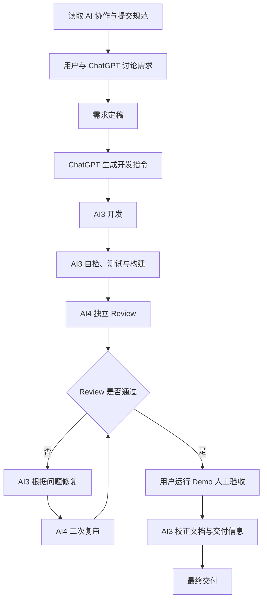

# 如何让 AI 写好代码：分析、开发、复审与验收

## —— 演示执行说明

- 文档日期：2026-08-20
- 演示工程：AiNfcDemo
- 当前状态：正确、可构建的 NFC Demo 基线版本；当前版本没有故意预留 Review Bug

## 1. 演示目标

本次演示的重点不是“NFC 有多复杂”，而是选择一个足够简单、又与公司业务相关的 NFC Demo，展示如何通过清晰分工和可验证产物，让 AI 参与完整研发流程：

```text
规范
  ↓
分析
  ↓
开发
  ↓
复审
  ↓
修订
  ↓
二次复审
  ↓
人工验收
  ↓
文档交付
```

评价标准不是代码量，而是需求是否完整、职责是否清晰、测试与构建是否可复现、Review 是否独立、最终是否能由人实际验收。

## 2. AI 角色

| 角色 | 职责 |
| --- | --- |
| 用户 | 负责最终需求裁决、范围控制与人工验收，不把最终决定权交给 AI。 |
| ChatGPT | 负责需求讨论、方案分析、任务拆解和研发指令生成。 |
| AI3 | 负责读取工程、开发、自检、修复、构建、提交和交付文档。 |
| AI4 | 负责独立代码 Review，不默认相信 AI3 的自检结论，以需求、Diff、测试和构建证据为准。 |

核心原则：开发与 Review 分离；AI 的结论必须能被代码、测试、构建产物和人工运行结果验证。

## 3. 演示流程图



## 4. 每阶段输入与输出

| 阶段 | 输入 | 主要执行者 | 输出/验收证据 |
| --- | --- | --- | --- |
| 规范 | `docs/AI协作与提交规范.md`，以及其他规范（如存在） | 全员 | 统一行为边界与交付口径 |
| 分析 | 原始需求、现有工程 | 用户 + ChatGPT | 确认后的范围、技术方案、开发指令 |
| 开发 | 最终需求 + 工程 | AI3 | `app`、`nfc-reader`、资源、测试 |
| 自检 | 代码 + 验证清单 | AI3 | Unit Test、Debug APK、Git Diff |
| Review | 最终需求 + Git Diff + 构建证据 | AI4 | 按严重度排序的审核问题；无问题时明确通过 |
| 修复 | Review 问题 | AI3 | 修复代码、回归测试、变更说明 |
| 二次复审 | 原问题 + 修复 Diff | AI4 | 逐项闭环结论与剩余风险 |
| 验收 | 最终 APK + 演示清单 | 用户 | 模拟 Text/URL、真实模式和布局人工验证结果 |
| 交付 | 最终代码 + 验证结果 | AI3 | README、Module 接入文档、Git 提交 |

## 5. 现场演示流程

### 第一步：让各 AI 阅读协作规范

进入工程，先读取 `docs/AI协作与提交规范.md`，如另有 `AI研发协作规范.md` 也一并读取；同时查看 Git 分支、HEAD 和工作区状态。强调不能覆盖用户已有修改、不能伪造测试结果。

### 第二步：用户向 ChatGPT 提出 NFC 需求

用户给出原始目标：一个可在模拟器演示、也支持真实设备读取的标准 NDEF Text / URL Demo，并要求 NFC 能力独立成 Module。

### 第三步：ChatGPT 与用户讨论并定稿

确认范围只包括 Text、URI、模拟输入、真实读取、异常状态、测试和文档；明确排除写卡、MIFARE、APDU、数据库、网络和复杂架构。

### 第四步：ChatGPT 生成 AI3 开发指令

开发指令应包含工程路径、职责边界、API 要求、模拟链路、UI 状态、测试命令、文档和 Git 收尾要求，而不是只说“做一个 NFC Demo”。

### 第五步：AI3 执行开发

AI3 先检查再修改，沿用 Java + XML + Material 体系。模拟按钮构造标准 `NdefRecord / NdefMessage`，真实与模拟共用解析器；完成测试、构建和自检后汇报证据。

### 第六步：AI4 独立 Review

AI4 从需求和 Diff 出发，不以 AI3 的“已完成”作为通过依据。重点检查解析边界、生命周期、线程、异常状态、Module 解耦、UI 文案、测试真实性和构建证据。

### 第七步：AI3 根据 Review 修复

AI3 逐条确认根因，只修改有效问题；新增必要回归测试，重新执行完整构建，并说明每个问题如何闭环。

### 第八步：AI4 二次复审

AI4 复核原问题是否真正消失，同时检查修复是否引入新问题。不能只看 AI3 的文字说明，应查看修复 Diff 和测试结果。

### 第九步：用户运行 Demo 验收

用户在模拟器实际点击模拟 Text、模拟 URL、模拟 Text + URL、关闭演示模式，观察状态、布局和稳定性。若有真机，再补充真实 NDEF 标签验证。

### 第十步：AI3 生成最终接入文档

AI3 以最终代码为准校正 `docs/NFC-Reader-Module接入说明.md`，确认示例 API 可编译、边界和验证结论没有夸大，最后完成 Git 提交但不 push。

## 6. 演示预置话术

以下 Prompt 可在现场直接复制。工程路径按现场实际位置替换。

### A. 阅读研发规范

```text
请先进入 D:\MyProjects\ai-nfc-demo。完整阅读 docs/AI协作与提交规范.md，以及仓库中的 AI研发协作规范.md（如果存在），然后检查当前分支、HEAD、git status、README、Gradle 和 app Module。先汇报工程现状与约束，不要修改代码。
```

### B. 用户向 ChatGPT 提出 NFC 原始需求

```text
我想做一个简单的 Android NFC Demo，用于演示 AI 协作开发。App 要能读取标准 NDEF Text 和 URL；现场主要用模拟器，所以也要有模拟 NFC 输入；NFC 能力要做成独立 Module。请先帮我分析需求、边界和最简单可靠的方案。
```

### C. 用户确认需求定稿

```text
确认按这个范围定稿：只支持标准 NDEF Text 和 URI，支持真实读取和模拟输入；模拟输入必须构造标准 NDEF Record 并复用真实解析逻辑；单页 UI；补齐核心单元测试、README、接入文档。不要加入写卡、MIFARE、APDU、网络、数据库或复杂架构。
```

### D. ChatGPT 下发 AI3 开发指令

```text
请在 D:\MyProjects\ai-nfc-demo 按定稿需求完成开发。先读取规范和 Git 状态，沿用现有技术栈；新增独立 :nfc-reader，app 只负责 UI；实现 Reader Mode、Text/URI 统一解析、模拟标准 NDEF、异常和生命周期；补齐 JVM 单元测试与两份 docs。最后执行 clean、testDebugUnitTest、assembleDebug，检查 APK、git diff 和敏感/构建文件，允许 commit，禁止 push。不要故意制造 Review Bug。
```

### E. AI4 独立 Review 指令

```text
请对 D:\MyProjects\ai-nfc-demo 做独立代码 Review。先读最终需求、协作规范和 Git Diff，不默认相信开发者自检结论，也不要修改代码。重点检查：需求完整性；NDEF Text/URI 解析；payload 长度、编码和 URI Prefix 边界；非 NDEF/空/不支持 Record；Reader Mode 生命周期和回调线程；null/异常安全；Module API 与 app 解耦；用户文案和长内容布局；日志、冗余和过度设计；单元测试有效性；构建与 APK 证据。按严重度列出可定位的问题；若无问题，明确说明检查范围和剩余实机风险。
```

### F. AI3 修复指令

```text
请读取 AI4 Review 结果，逐项验证根因并修复确认有效的问题。保持当前简洁架构，不做无关重构；每个解析或生命周期问题都补相应回归测试。修复后重新执行 clean、testDebugUnitTest、assembleDebug，并汇报问题闭环、测试数量、APK 和 Git Diff。不要 push。
```

### G. AI4 二次复审指令

```text
请对 AI3 的修复做二次独立复审。逐条对照上次问题检查代码和新增测试，确认不是只改文案或绕过症状；同时检查修复是否引入生命周期、线程、解析或 UI 回归。复核构建证据，给出“通过/不通过”和仍需人工实机验证的风险。不要修改代码。
```

### H. AI3 生成最终接入文档指令

```text
Review 通过后，请以最终代码 API 为唯一依据校正 docs/NFC-Reader-Module接入说明.md。确保首次接入者能独立完成 Module 引入、Manifest、创建、start/stop、Text/URL 结果处理、生命周期、模拟数据和异常处理；示例必须与代码一致。更新最终验证结果和 Git 信息，提交但不要 push。
```

## 7. 换机 / 新会话快速恢复

新电脑或新 AI 会话进入工程后，先读取：

```text
docs/AI协作与提交规范.md
AI研发协作规范.md（如果仓库中另行存在）
docs/AI协作研发演示说明.md
docs/NFC-Reader-Module接入说明.md
```

然后执行：

```powershell
git status
git log --oneline -10
```

结合当前分支、最新提交、工作区 Diff 和文档中的“当前状态”判断演示进行到哪一阶段。不要仅凭聊天记忆覆盖仓库事实。

### 可直接复制的恢复指令

```text
这是一个换机后的新 AI 会话。请进入当前 AiNfcDemo 工程，完整读取 docs/AI协作与提交规范.md、AI研发协作规范.md（如另行存在）、docs/AI协作研发演示说明.md、docs/NFC-Reader-Module接入说明.md；执行 git status 和 git log --oneline -10，并查看未提交 Diff。请根据仓库证据告诉我：当前分支/HEAD、已完成阶段、测试与构建状态、是否存在未闭环 Review 问题、下一步最小动作。未确认前不要覆盖已有修改，也不要 push。
```

## 8. 演示注意事项

- 正式演示主要使用 Android 模拟器，不依赖真实 NFC 标签。
- 演示模式是主路径，App 默认开启演示模式。
- 模拟 Text、URL 和 Text + URL 仍经过 `nfc-reader` 的标准 NDEF 解析链路，不是 UI 直接填值。
- 模拟或真实读取成功后会短振动一次，现场无需持续盯着屏幕确认是否读到。
- 关闭演示模式可展示真实 NFC 能力；普通模拟器应稳定显示“当前设备不支持 NFC”。
- 页面采用基座标准安全区结构：状态栏占位层、固定标题栏、独立滚动内容区，避免小屏 PDA 滚动时标题进入状态栏。
- 真实 NFC 读取只能用具备 NFC 的 Android 设备和标准 NDEF 标签最终确认。
- 如果现场 AI 执行时间过长，可切换到预置的已提交代码状态继续讲解，但要明确这是预置基线，不能伪称现场生成已完成。
- 现场重点是规范、分析、开发、独立 Review、修复、证据和人工验收的闭环，不是 NFC 技术细节或代码量。
- AI Review 不能替代人工验收；最终仍由用户运行 App 完成模拟 Text、模拟 URL、模拟双内容、模式切换和页面布局检查。
- 当前基线版本不故意制造 Bug。若要演示“Review 发现问题”，应从正确基线另建演示分支或提交，并保留可快速恢复的正确状态。

## 9. 当前工程交付检查点

现场开始前建议确认：

1. `testDebugUnitTest` 通过，测试数量与报告一致。
2. `assembleDebug` 通过，Debug APK 存在。
3. 模拟器可启动 App，默认显示演示模式。
4. Text 显示“欢迎使用 NFC Reader”，URL 显示完整长链接，双内容按钮一次显示两项。
5. 关闭演示模式后模拟卡片隐藏，无 NFC 时不崩溃。
6. 两份 docs 中的 API 与最终源码一致。
7. Git 工作区状态清楚，现场使用哪个基线提交已提前记录。
