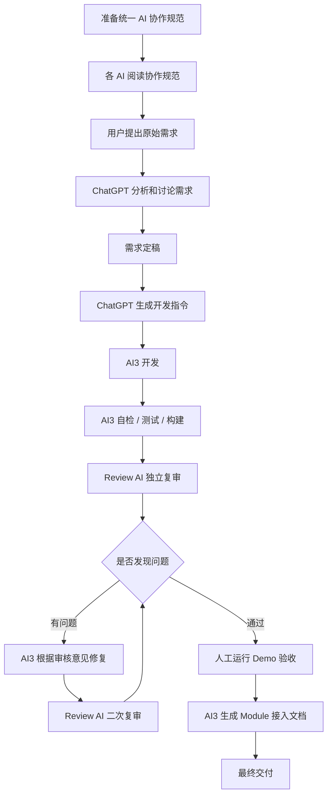
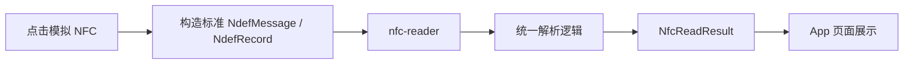
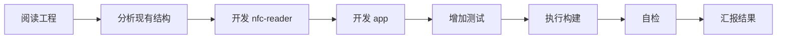
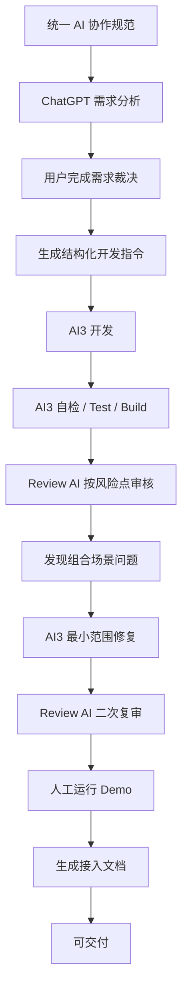

# 如何让 AI 写好代码：分析、开发、复审与验收

> 演示工程：`ai-nfc-demo`  
> 演示主题：NFC Text / URL 读取 Module  
> 开发 AI：AI3 · Review AI：AI1 · 需求分析/指令生成：ChatGPT

[TOC]

---

## 一、这次分享想讲什么

**不是**讲某个 AI 工具有多强，也**不是**讲 NFC 技术本身。  
核心只回答一个问题：

> **AI 会写代码以后，怎样让它把代码真正写好，并最终达到可交付状态？**

关键转变：

```text
不是：
需求 → AI → 生成代码 → 完成

而是：
规范 → 分析 → 开发 → 自检 → 复审 → 修复 → 再复审 → 人工验收 → 文档交付
```

AI 写代码，只是整个链路中的一个环节。

---

## 二、整体协作流程



---

## 三、角色分工

| 角色 | 主要职责 |
|------|----------|
| 用户 | 提出需求、业务裁决、最终人工验收 |
| ChatGPT | 需求分析、方案讨论、边界梳理、生成开发及审核指令 |
| AI3 | 工程分析、代码开发、自检、测试、构建、问题修复 |
| Review AI（AI1） | 独立检查代码、发现问题、形成审核报告、二次复审 |
| 人工 | 最终运行程序，确认实际结果符合预期 |

**核心原则：**

> **不要让同一个 AI 从需求到开发全程“自证正确”。**  
> 开发与审核尽量拆开，由不同角色承担。

---

## 四、为什么先准备 AI 协作规范

正式写代码前，先让所有参与任务的 AI 阅读统一的研发规范，明确行为边界。

规范重点包括：

- 先理解工程，再修改代码
- 优先沿用原有代码风格
- 避免过度设计
- 用户可见文案资源化
- 关键逻辑使用必要中文注释
- 注意 null、数组越界、异常和生命周期
- 优先复用现有能力，不重复造轮子
- 删除无效和冗余代码
- 日志保证可定位问题，同时注意敏感信息
- 完成后必须测试、构建、自检
- 默认不随意 push
- 发现需求或指令不合理时，主动提出

> **不要只告诉 AI“做什么”，还要提前告诉它“应该怎样做”。**

---

## 五、演示需求（NFC Reader Module）

工程结构：

```text
ai-nfc-demo
├── app
└── nfc-reader
```

### `nfc-reader`（独立 NFC 能力模块）

支持：
- 标准 NDEF Text
- 标准 NDEF URL / URI
- Text + URL 同时读取
- 真实 NFC 和模拟 NFC
- 基本异常处理

### `app`（演示宿主）

页面支持：
- 演示模式开关
- 模拟 Text、模拟 URL、模拟 Text + URL
- 读取结果展示
- 关闭演示模式后切换至真实 NFC 模式

---

## 六、为什么使用模拟 NFC

现场分享主要基于 Android 模拟器，因此增加模拟能力，避免依赖真实标签。

模拟流程并非绕过 Module，而是：



即使没有真实标签，也能完整演示 Module 的解析链路。

---

## 七、现场演示流程（分阶段）

### 第一阶段：让 AI 阅读规范

展示 `docs/AI协作与提交规范.md`，说明：

> 第一步不是写代码，而是建立统一的研发行为边界。

---

### 第二阶段：与 ChatGPT 讨论需求

提出原始需求，要求先分析、不写代码。  
ChatGPT 帮助确定：

- Module 与 App 的职责划分
- 支持/不支持的数据类型
- API 设计、生命周期处理、异常返回
- 测试策略与避免过度设计

最终形成**经过确认的开发口径**。

---

### 第三阶段：生成 AI3 开发指令

将以下完整上下文发给 AI3：

```text
协作规范 + 最终需求 + 工程位置 + 开发范围 + 禁止范围
+ 测试要求 + 构建要求 + Git 要求 + 完成后的汇报要求
```

> **好的开发结果，取决于输入的上下文是否完整。**  
> 而不是一句“帮我开发一个 NFC 功能”。

---

### 第四阶段：AI3 开发

AI3 执行流程：



现场代码已提前准备，主要展示**指令内容、执行步骤和最终输出**，无需等待完整开发。

汇报内容涵盖：Module、App、单元测试、Lint、Build、APK/AAR、真机验证。

---

### 第五阶段：独立 Review（重点）

AI3 自认为“测试通过、构建通过、真机正常”，但：

> **AI3 说“完成”并不等于任务真的完成。**

将代码交给 **AI1** 做独立审核。  
审核时需明确 **Review Scope**，而非泛泛“看看有没有问题”。

本次重点检查：

- Text 单独读取、URL 单独读取
- Text + URL 同时存在
- `NfcReadResult` 到 App UI 的展示链路
- 组合结果是否完整展示
- UI 条件分支是否错误地形成互斥
- null / 空数据、生命周期
- Module API 设计
- 测试是否覆盖真实业务组合场景

> **AI Review 也需要明确的审核范围。**

---

### 演示案例（提前准备的可复现问题）

问题表现：
- Text 单独 → 正常  
- URL 单独 → 正常  
- Text + URL → 页面遗漏其中一个结果  

特点：
- 编译通过，不崩溃
- Module 数据正确
- Smoke Test 极易遗漏
- 问题藏在组合场景的 UI 展示逻辑中

> **Build Success 不代表业务逻辑正确。**

---

### Review AI 输出

要求输出 Markdown 审核文档（如 `docs/AI-Review-Result.md`），包含：

```text
审核结论 | 问题级别 | 涉及文件 | 问题描述
触发条件 | 影响 | 建议修改方式
```

现场重点展示 Review AI 发现的组合展示问题。

---

### 第六阶段：AI3 返修

将审核文档交给 AI3，要求：

> 只针对确认存在的问题进行最小范围修复，不扩大重构。

AI3 执行：阅读审核 → 确认问题 → 修改代码 → 补充验证 → 测试 → Build → 汇报修复结果。

**审核 AI 不负责修改，开发 AI 根据意见返修，职责保持分离。**

---

### 第七阶段：二次复审

再次让 Review AI（AI1）：
- 查看原问题
- 查看最新修改
- 确认原问题是否真正解决
- 检查是否引入新问题
- 给出最终结论

预期结论：

```text
复审通过。原问题已修复，未发现新的阻塞问题，可进入人工验收。
```

---

### 第八阶段：人工验收

即使 AI3 和 Review AI 都通过，仍须人工最终验证。

运行 Demo：
- 模拟 Text → 正确展示 Text
- 模拟 URL → 正确展示 URL
- 模拟 Text + URL → 两者均正确展示

最后简要展示真实 NFC 模式入口。

> **AI 扩大覆盖，但最终结果仍需人工确认。**

---

### 第九阶段：生成可交付物

让 AI3 根据实际代码生成接入文档（`docs/NFC-Reader-Module接入说明.md`），包含：

- 功能概述、环境要求
- 引入方式、Gradle 配置
- 权限、生命周期
- 核心 API（Text/URL 读取、错误处理）
- 完整调用示例
- 当前能力边界

最终交付物：

```text
代码 + 测试 + 审核结果 + 可运行 Demo + Module 接入文档
```

---

## 八、最终完整闭环



---

## 九、总结

一句话：

> **AI 写代码不难，难的是让 AI 写出的代码可信、可验证、可维护、可交付。**

这套流程的核心不是“用几个 AI”，而是建立清晰的阶段：

```text
分析 → 开发 → 复审 → 验收 → 交付
```

不同 AI 承担不同角色，工具可变，流程可复用。

---

## 十、现场环境备注

- 演示工程路径：`/Users/shenyang/MyProjects/ai-nfc-demo`
- 主要目录：`app/`、`nfc-reader/`、`docs/`
- 文档：
  - `docs/AI协作研发演示说明.md`
  - `docs/AI协作与提交规范.md`
  - `docs/NFC-Reader-Module接入说明.md`
- AI 分工：
  - ChatGPT → 需求分析、生成指令
  - AI3 → 开发、修复、构建
  - AI1 → 独立 Review、二次复审

演示注意事项：
- AI3 的回复可直接查看，不强制生成审核文档；
- AI1 因会话不便复制，**审核和复审结果必须写入 Markdown 文件**；
- 审核时必须明确告知 Review Scope，不依赖完全开放式扫描；
- 演示重点是流程，无需现场从零完成整个工程；
- NFC Demo 和 Review Case 均已提前准备，现场展示完整协作过程即可。

